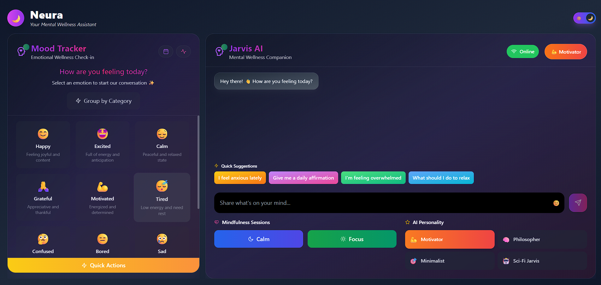

# 🧠 Mental Health Chatbot

An intelligent, calming chatbot built with **React + Tailwind CSS + TypeScript**, powered by **Meta's LLaMA 3** running locally. It includes chat functionality, mood tracking, and light/dark themes — designed to offer a helpful and empathetic experience for mental well-being.

---

## 🌐 Live Preview (soon)
> _Coming soon!_

---

## ✨ Features

- 💬 **Chat interface** powered by LLaMA 3
- 📊 **Mood Tracker** to log emotional states
- 🌙 **Light/Dark Theme Toggle**
- ⚛️ Built with **React**, styled with **Tailwind CSS**
- 🔒 Runs LLaMA 3 *entirely locally* — no external AI APIs!

---

## 🧱 Project Structure
mental-health-bot/
├── backend/ # FastAPI server running LLaMA 3
├── src/ # React frontend
│ ├── components/ # Chat UI, Mood Tracker, etc.
│ ├── assets/
├── public/
├── server.js # Express or Vite dev server
├── tailwind.config.js
└── README.md

---

## 🧪 Tech Stack

- **Frontend:** React, TypeScript, Tailwind CSS, Vite
- **Backend:** FastAPI + Transformers (LLaMA 3)
- **Local AI Runtime:** Meta's LLaMA 3 model

---
